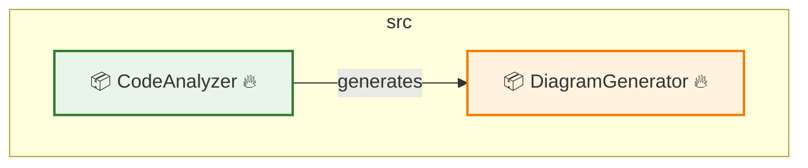
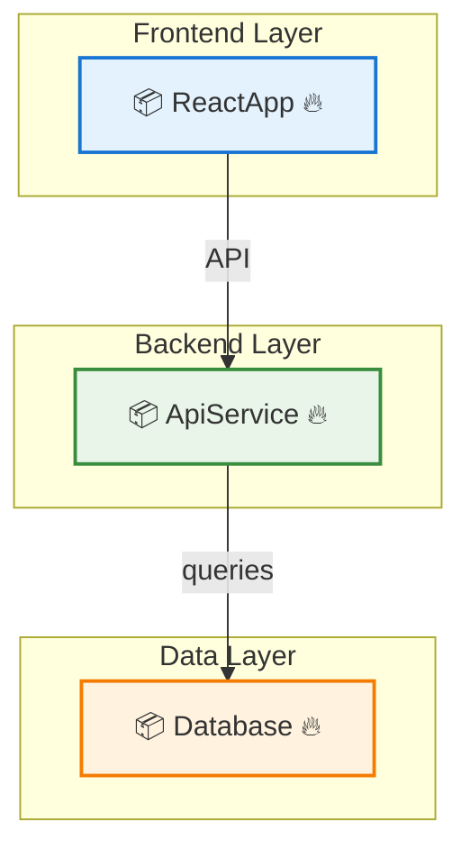

# Diagrammer - Architecture Diagram Generator

A GitHub Actions integration that automatically generates, maintains, and updates software architecture diagrams from your code repositories. Inspired by the [Mindcraft project's architecture documentation](https://github.com/samjhill/mindcraft/blob/develop/ARCHITECTURE.md).

## ✨ Features

### 🎨 **Rich Visualizations**
- **10 Diagram Types**: Architecture, layered, API flow, data flow, event flow, and more
- **Semantic Component Classification**: 8 distinct component types with purpose-specific colors
- **Smart Relationship Detection**: Automatic inference of component interactions and dependencies
- **Visual Indicators**: Emoji-based indicators for size, complexity, and dependencies (📦📄📝⚡🔥🔗)

### 🧠 **Architectural Intelligence**
- **Framework Detection**: Automatic detection of React, Vue, Angular, Express, Django, Flask, etc.
- **Layer Classification**: Frontend, backend, data, infrastructure layer identification
- **Pattern Recognition**: MVC, microservices, event-driven, layered architecture patterns
- **Enhanced Relationships**: API calls, event flows, data flows, service communication

### 🎯 **Smart Analysis**
- **Multi-language Support**: JavaScript, TypeScript, and Python
- **Smart Filtering**: Automatically filters out test files, dependency layers, and internal details
- **Size Limits**: Configurable limits to prevent overly complex diagrams (max 30 nodes, 50 dependencies)
- **Rich Metadata**: Comprehensive statistics, legends, and architectural insights

### ⚙️ **Configuration & Automation**
- **Zero Configuration**: Works out of the box with sensible defaults
- **Automatic Updates**: Diagrams update automatically on code changes
- **Configurable**: Customize analysis and output via `.diagrammer.yml`
- **Auto-commit**: Automatically commits generated diagrams to your repository

## 🆕 What's New in v1.3.0

**Major Visualization Enhancements:**
- 🎨 **Semantic Component Classification**: 8 distinct component types with purpose-specific colors
- 🔗 **Smart Relationship Detection**: Automatic inference of component interactions and dependencies
- 📊 **Rich Metadata & Statistics**: Component counts, language analysis, and architectural insights
- 🎯 **Professional Legends**: Comprehensive explanations of colors, symbols, and relationship types
- 🏗️ **Architectural Intelligence**: Automatic pattern recognition and component categorization

**Visual Improvements:**
- **Component Types**: Analyzer (🟢), Generator (🟠), Manager (🟣), Service (🔵), NPM (🔵), Framework (🟢), External (🔴)
- **Relationship Labels**: imports, calls, generates, uses, API, data flow
- **Enhanced Layout**: Better grouping and semantic organization
- **Interactive Documentation**: Detailed legends and architectural context

## 🚀 Quick Start

### 1. Required Permissions Setup

**⚠️ Important**: Before using the diagrammer action, you must configure permissions in your workflow to allow it to commit generated diagrams back to your repository.

Add these permissions to your workflow file:

```yaml
permissions:
  contents: write      # Required to push generated diagrams
  pull-requests: write # Required for PR-based workflows
```

**Without these permissions, you'll get 403 errors when the action tries to commit diagrams.**

### 2. Add the Action to Your Repository

Create `.github/workflows/diagrammer.yml`:

```yaml
name: Generate Architecture Diagrams

on:
  push:
    branches: [ main, develop ]
  pull_request:
    branches: [ main ]

permissions:
  contents: write
  pull-requests: write

jobs:
  generate-diagrams:
    runs-on: ubuntu-latest
    
    steps:
    - name: Checkout code
      uses: actions/checkout@v4
      with:
        token: ${{ secrets.GITHUB_TOKEN }}
        fetch-depth: 0
        
    - name: Generate Architecture Diagrams
      uses: samjhill/diagrammer@v1.3.0
      with:
        github_token: ${{ secrets.GITHUB_TOKEN }}
        output_path: 'docs/architecture'
        languages: 'javascript,typescript,python'
        auto_commit: 'true'
```

### 3. Auto-Commit Configuration

The `auto_commit` input controls whether generated diagrams are automatically committed to your repository:

- `auto_commit: 'true'` (default): Automatically commits generated diagrams
- `auto_commit: 'false'`: Only generates diagrams without committing

**Required Permissions for Auto-Commit:**
- `contents: write` - Allows the action to push commits
- `pull-requests: write` - Required for PR-based workflows

## 📊 Generated Diagrams

The action generates 10 different types of architecture diagrams:

1. **Architecture Overview** - Main system architecture with component relationships
2. **Dependency Graph** - External and internal dependencies
3. **Module Structure** - Code organization and module hierarchy
4. **Layered Architecture** - Architectural layers and their interactions
5. **MVC Pattern** - Model-View-Controller pattern visualization
6. **Microservices Pattern** - Microservice architecture and communication
7. **API Flow** - API endpoints and data flow
8. **Data Flow** - Data movement and transformations
9. **Event Flow** - Event-driven architecture patterns
10. **Service Communication** - Inter-service communication patterns

## ⚙️ Configuration

Create a `.diagrammer.yml` file in your repository root to customize the analysis:

```yaml
analysis:
  includeTests: false        # Exclude test files from analysis
  maxDepth: 3               # Maximum directory depth to analyze
  languages:                # Supported languages
    - javascript
    - typescript
    - python

diagram:
  maxNodesPerDiagram: 30    # Maximum components per diagram
  maxDependenciesPerDiagram: 50  # Maximum dependencies per diagram
  excludeInternalMethods: true   # Exclude internal implementation details
```

## 🎨 Visual Features

### Component Types & Colors
- **🔍 Analyzer** (Green) - Code analysis components
- **🎨 Generator** (Orange) - Diagram generation components  
- **⚙️ Manager** (Purple) - Resource management components
- **🔧 Service** (Teal) - Business logic and services
- **📦 NPM** (Blue) - Node.js packages
- **🌐 Framework** (Green) - Framework dependencies
- **🔗 External** (Red) - External services and APIs

### Visual Indicators
- **📦** Large components (>100 lines)
- **📄** Medium components (50-100 lines)
- **📝** Small components (<50 lines)
- **⚡** High complexity components
- **🔥** Medium complexity components
- **🔗** High dependency components

### Relationship Types
- **imports** - Module imports and dependencies
- **calls** - Function/method calls
- **generates** - Component generates output
- **uses** - Component utilizes another component
- **API** - API calls and communication
- **data** - Data flow between components

## 🔧 Troubleshooting

### Auto-Commit Issues

**Problem**: Diagrams are generated but not committed to the repository.

**Solutions**:
1. **Use Latest Version**: Ensure you're using `samjhill/diagrammer@v1.3.0` or later
2. **Check Permissions**: Verify `contents: write` permission is set
3. **Verify Checkout**: Ensure `fetch-depth: 0` is set in checkout step
4. **Disable Auto-Commit**: Set `auto_commit: 'false'` and commit manually

### Manual Commit Alternative

If auto-commit isn't working, you can commit the generated diagrams manually:

```yaml
- name: Generate Architecture Diagrams
  uses: samjhill/diagrammer@v1.3.0
  with:
    auto_commit: 'false'
    
- name: Commit Generated Diagrams
  run: |
    git config user.name "github-actions[bot]"
    git config user.email "github-actions[bot]@users.noreply.github.com"
    git add docs/architecture/
    git commit -m "docs: update architecture diagrams [skip ci]" || exit 0
    git push
```

### Common Permission Errors

**Error**: `Resource not accessible by integration`
- **Solution**: Add `contents: write` permission to your workflow

**Error**: `Permission denied`
- **Solution**: Ensure `GITHUB_TOKEN` is properly configured

**Error**: `Not in a git repository`
- **Solution**: Add `fetch-depth: 0` to the checkout step

## 📈 Examples

### Architecture Overview


### Layered Architecture


## 🤝 Contributing

Contributions are welcome! Please feel free to submit a Pull Request.

## 📄 License

This project is licensed under the MIT License - see the [LICENSE](LICENSE) file for details.

## 🙏 Acknowledgments

- Inspired by the [Mindcraft project's architecture documentation](https://github.com/samjhill/mindcraft/blob/develop/ARCHITECTURE.md)
- Built with [Mermaid](https://mermaid-js.github.io/) for diagram generation
- Powered by GitHub Actions for seamless integration

---

*Generated by [Diagrammer GitHub Action](https://github.com/samjhill/diagrammer)*