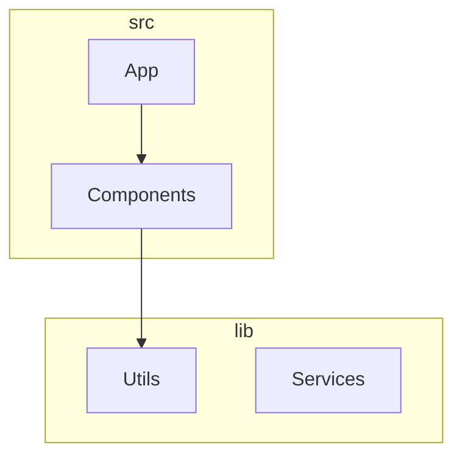

# Diagrammer - Architecture Diagram Generator

A GitHub Actions integration that automatically generates, maintains, and updates software architecture diagrams from your code repositories. Inspired by the [Mindcraft project's architecture documentation](https://github.com/samjhill/mindcraft/blob/develop/ARCHITECTURE.md).

## Features

- 🚀 **Zero Configuration**: Works out of the box with sensible defaults
- 🔄 **Automatic Updates**: Diagrams update automatically on code changes
- 📊 **Multiple Views**: Architecture, dependency, and module diagrams
- 🎨 **Mermaid Integration**: Native GitHub rendering support
- ⚙️ **Configurable**: Customize analysis and output via `.diagrammer.yml`
- 🌐 **Multi-language**: Supports JavaScript, TypeScript (Python, Java, Go coming soon)

## Quick Start

### 1. Add the Action to Your Repository

Create `.github/workflows/diagrammer.yml`:

```yaml
name: Generate Architecture Diagrams

on:
  push:
    branches: [ main, develop ]
  pull_request:
    branches: [ main ]

jobs:
  generate-diagrams:
    runs-on: ubuntu-latest
    
    steps:
    - name: Checkout code
      uses: actions/checkout@v4
      with:
        token: ${{ secrets.GITHUB_TOKEN }}
        
    - name: Generate Architecture Diagrams
      uses: samjhill/diagrammer@v1  # Always uses latest v1.x.x version
      with:
        github_token: ${{ secrets.GITHUB_TOKEN }}
        output_path: 'docs/architecture'
        languages: 'javascript,typescript'
```

### 2. Optional Configuration

Create `.diagrammer.yml` in your repository root:

```yaml
diagram:
  theme: "default"
  direction: "TB"

analysis:
  includeTests: false
  maxDepth: 5

output:
  path: "docs/architecture"
  autoCommit: true
```

### 3. That's It!

The action will:
- Analyze your codebase on every push/PR
- Generate architecture diagrams
- Commit them to your repository
- Update automatically when code changes

## Generated Diagrams

### Architecture Overview
Shows the high-level structure of your application with components grouped by directory.

### Dependency Graph
Visualizes how components depend on each other and external libraries.

### Module Structure
Displays the module organization and export relationships.

## Version Options

You can specify different versions of the action:

| Version | Description | Stability | Build Time |
|---------|-------------|-----------|------------|
| `@v1` | Latest v1.x.x version (recommended) | Stable | ~4-5 min |
| `@v1.0` | Latest v1.0.x version | Very stable | ~30 sec |
| `@v1.0.4` | Specific version | Most stable | ~30 sec |
| `@main` | Latest from main branch | Unstable | ~4-5 min |

**Recommended**: 
- Use `@v1` for production (automatic updates)
- Use `@v1.0.4` for testing (faster builds)

## Configuration Options

| Option | Description | Default |
|--------|-------------|---------|
| `output_path` | Where to store generated diagrams | `docs/architecture` |
| `config_file` | Path to configuration file | `.diagrammer.yml` |
| `languages` | Comma-separated languages to analyze | `javascript,typescript` |

## Example Output

Generated diagrams are stored as Markdown files with embedded Mermaid diagrams that render natively in GitHub:

```markdown
# Architecture Overview



## Development

### Running Tests

```bash
# Install dependencies
npm install

# Run the test suite
npm test

# Clean test outputs
npm run clean
```

### Testing with Docker

```bash
# Build the Docker image
docker build -t diagrammer .

# Test with sample project
docker run --rm --entrypoint="" \
  -v "$(pwd):/workspace" -w /workspace \
  diagrammer node tests/test.js
```

## Contributing

We welcome contributions! Please see our [Contributing Guide](CONTRIBUTING.md) for details.

## License

MIT License - see [LICENSE](LICENSE) for details.

## Roadmap

- [ ] Python, Java, Go language support
- [ ] AI-powered component classification
- [ ] Custom diagram templates
- [ ] Interactive web exports
- [ ] Enterprise features

## Support

- 📖 [Documentation](https://github.com/samjhill/diagrammer/wiki)
- 🐛 [Report Issues](https://github.com/samjhill/diagrammer/issues)
- 💬 [Discussions](https://github.com/samjhill/diagrammer/discussions)
# Trigger enhanced diagram generation
