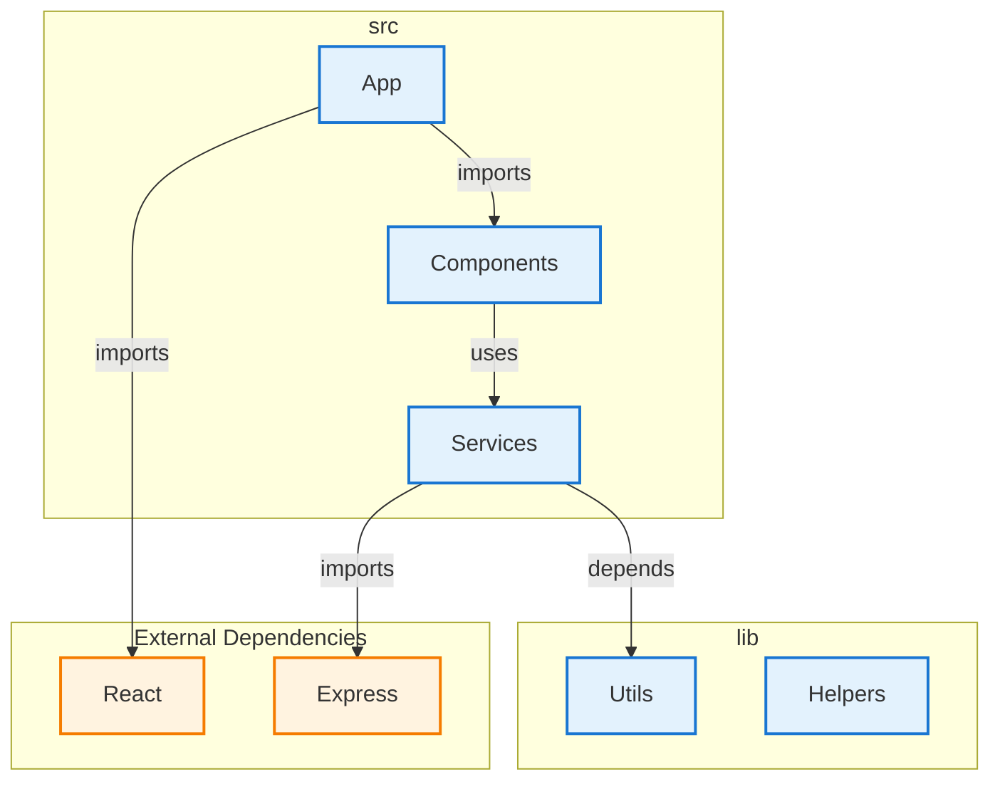
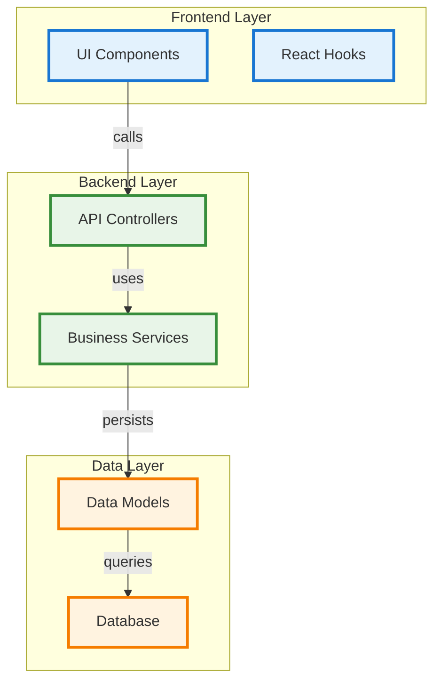

# Diagrammer - Architecture Diagram Generator

A GitHub Actions integration that automatically generates, maintains, and updates software architecture diagrams from your code repositories. Inspired by the [Mindcraft project's architecture documentation](https://github.com/samjhill/mindcraft/blob/develop/ARCHITECTURE.md).

## Features

- 🚀 **Zero Configuration**: Works out of the box with sensible defaults
- 🔄 **Automatic Updates**: Diagrams update automatically on code changes
- 📊 **10 Diagram Types**: Architecture, layered, API flow, data flow, event flow, and more
- 🎨 **Rich Visualizations**: Color-coded components with labeled relationships
- 🧠 **Architectural Intelligence**: Framework detection, layer classification, pattern recognition
- 🔗 **Enhanced Relationships**: API calls, event flows, data flows, service communication
- 🎯 **Smart Filtering**: Automatically filters out test files, dependency layers, and internal details
- 📏 **Size Limits**: Configurable limits to prevent overly complex diagrams (max 30 nodes, 50 dependencies)
- ⚙️ **Configurable**: Customize analysis and output via `.diagrammer.yml`
- 🌐 **Multi-language**: Supports JavaScript, TypeScript, and Python
- 🎯 **Sophisticated Analysis**: Matches enterprise-grade architecture documentation quality

## Quick Start

### 1. Add the Action to Your Repository

Create `.github/workflows/diagrammer.yml`:

```yaml
name: Generate Architecture Diagrams

on:
  push:
    branches: [ main, develop ]
  pull_request:
    branches: [ main ]

jobs:
  generate-diagrams:
    runs-on: ubuntu-latest
    
    steps:
    - name: Checkout code
      uses: actions/checkout@v4
      with:
        token: ${{ secrets.GITHUB_TOKEN }}
        
    - name: Generate Architecture Diagrams
      uses: samjhill/diagrammer@v1.2.4  # Latest version with auto-commit fixes
      with:
        github_token: ${{ secrets.GITHUB_TOKEN }}
        output_path: 'docs/architecture'
        languages: 'javascript,typescript,python'
        auto_commit: 'true'  # Automatically commit generated diagrams
```

### 2. Auto-Commit Configuration

The action automatically commits generated diagrams by default. You can control this behavior:

```yaml
- name: Generate Architecture Diagrams
  uses: samjhill/diagrammer@v1.2.4
  with:
    github_token: ${{ secrets.GITHUB_TOKEN }}
    output_path: 'docs/architecture'
    languages: 'javascript,typescript,python'
    auto_commit: 'true'  # Enable auto-commit (default)
    # auto_commit: 'false'  # Disable auto-commit
```

**Required Permissions**: Ensure your workflow has `contents: write` permission:
```yaml
permissions:
  contents: write
```

### 3. Optional Configuration

Create `.diagrammer.yml` in your repository root:

```yaml
diagram:
  theme: "default"
  direction: "TB"

analysis:
  includeTests: false
  maxDepth: 5

output:
  path: "docs/architecture"
  autoCommit: true
```

### 3. That's It!

The action will:
- Analyze your codebase on every push/PR
- Generate architecture diagrams
- Commit them to your repository
- Update automatically when code changes

## Generated Diagrams

Diagrammer generates **10 sophisticated diagram types** with architectural intelligence:

### 🏗️ Architecture Overview
High-level structure with components grouped by directory and architectural roles.

### 📚 Layered Architecture  
Components organized by architectural layers (frontend, backend, data, infrastructure).

### 🔗 API Flow
API relationship analysis showing endpoints, HTTP methods, and service communication.

### 📊 Data Flow
Data flow between components including state, props, and database operations.

### ⚡ Event Flow
Event emission and subscription relationships with event-driven architecture patterns.

### 🤝 Service Communication
Service-to-service method calls and inter-service dependencies.

### 📦 Dependency Graph
Enhanced dependency visualization with labeled arrows and external/internal classification.

### 🗂️ Module Structure
Module organization with language tags and export relationships.

### 🎯 MVC Pattern
Model-View-Controller pattern recognition and component classification.

### 🏢 Microservices Pattern
Microservices architecture detection and service boundary visualization.

## Version Options

You can specify different versions of the action:

| Version | Description | Stability | Build Time |
|---------|-------------|-----------|------------|
| `@v1` | Latest v1.x.x version (recommended) | Stable | ~4-5 min |
| `@v1.0` | Latest v1.0.x version | Very stable | ~30 sec |
| `@v1.0.4` | Specific version | Most stable | ~30 sec |
| `@main` | Latest from main branch | Unstable | ~4-5 min |

**Recommended**: 
- Use `@v1` for production (automatic updates)
- Use `@v1.0.4` for testing (faster builds)

## Configuration Options

| Option | Description | Default |
|--------|-------------|---------|
| `output_path` | Where to store generated diagrams | `docs/architecture` |
| `config_file` | Path to configuration file | `.diagrammer.yml` |
| `languages` | Comma-separated languages to analyze | `javascript,typescript` |

## Example Output

Generated diagrams are stored as Markdown files with embedded Mermaid diagrams that render natively in GitHub. Here's an example of what you'll get:

### Architecture Overview



### Layered Architecture



## Development

### Running Tests

```bash
# Install dependencies
npm install

# Run the test suite
npm test

# Clean test outputs
npm run clean
```

### Testing with Docker

```bash
# Build the Docker image
docker build -t diagrammer .

# Test with sample project
docker run --rm --entrypoint="" \
  -v "$(pwd):/workspace" -w /workspace \
  diagrammer node tests/test.js
```

## Troubleshooting

### Auto-Commit Issues

If you see `"Not in a git repository, skipping commit"`:

1. **Use the latest version**: Ensure you're using `samjhill/diagrammer@v1.2.2` or later
2. **Check permissions**: Add `permissions: contents: write` to your workflow
3. **Verify checkout**: Use `actions/checkout@v4` with `fetch-depth: 0`
4. **Disable auto-commit**: Set `auto_commit: 'false'` and handle commits manually

### Manual Commit Alternative

If auto-commit continues to fail, you can handle commits manually:

```yaml
- name: Generate Architecture Diagrams
  uses: samjhill/diagrammer@v1.2.4
  with:
    auto_commit: 'false'
    # ... other inputs

- name: Commit and push diagrams
  run: |
    git config --local user.email "github-actions[bot]@users.noreply.github.com"
    git config --local user.name "github-actions[bot]"
    git add docs/architecture/
    if git diff --staged --quiet; then
      echo "No changes to commit"
    else
      git commit -m "Update architecture diagrams [skip ci]"
      git push
    fi
```

## Contributing

We welcome contributions! Please see our [Contributing Guide](CONTRIBUTING.md) for details.

## License

MIT License - see [LICENSE](LICENSE) for details.

## Roadmap

- [ ] Python, Java, Go language support
- [ ] AI-powered component classification
- [ ] Custom diagram templates
- [ ] Interactive web exports
- [ ] Enterprise features

## Support

- 📖 [Documentation](https://github.com/samjhill/diagrammer/wiki)
- 🐛 [Report Issues](https://github.com/samjhill/diagrammer/issues)
- 💬 [Discussions](https://github.com/samjhill/diagrammer/discussions)
# Trigger enhanced diagram generation
