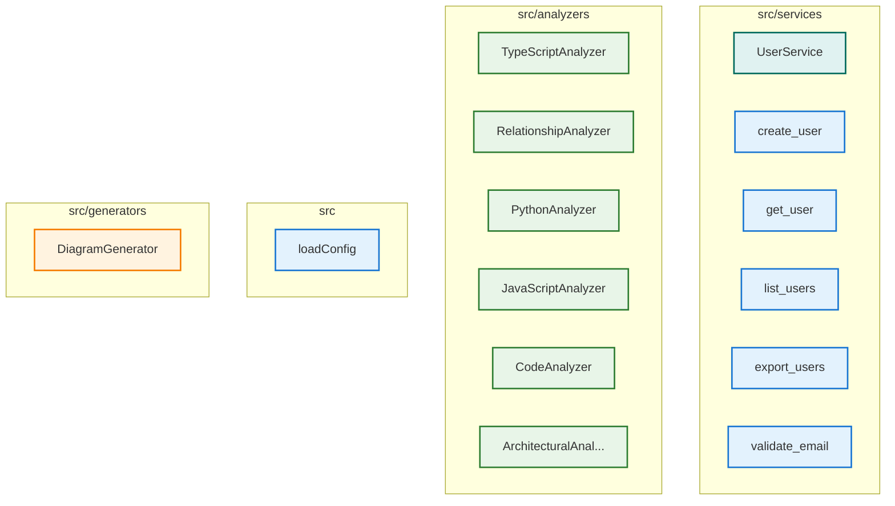

# Architecture Overview

This diagram was automatically generated from your codebase.

## 📊 Architecture Overview

- **Components**: 23 analyzed
- **Languages**: javascript, python
- **Architectural Patterns**: MICROSERVICES
- **External Dependencies**: 12 packages
- **Generated**: 10/21/2025

## 🎨 Legend

| Component Type | Color | Description |
|---|---|---|
| 🔍 **Analyzer** | Green | Code analysis components |
| 🎨 **Generator** | Orange | Diagram generation components |
| ⚙️ **Manager** | Purple | Resource management components |
| 🔧 **Service** | Teal | Business logic and services |
| 📦 **NPM** | Blue | Node.js packages |
| 🏗️ **Framework** | Light Green | Framework dependencies |
| 🌐 **External** | Red | External libraries |

## 🔗 Relationship Types

- **imports**: Module imports and dependencies
- **calls**: Method/function calls
- **generates**: Component generates output
- **uses**: Component utilizes another component
- **API**: API calls and communication
- **data**: Data flow between components

---
*Generated by [Diagrammer GitHub Action](https://github.com/samjhill/diagrammer)*
