# Architecture Overview

This diagram was automatically generated from your codebase.

## 📊 Architecture Overview

- **Components**: 18 analyzed
- **Languages**: javascript
- **Architectural Patterns**: None detected
- **External Dependencies**: 12 packages
- **Generated**: 10/22/2025

## 🧠 Architectural Insights

- 🔍 **High Analysis Complexity**: Multiple analyzers detected - consider consolidating analysis logic
- 🌐 **High External Dependencies**: Consider reducing external dependencies for better maintainability
- 🔄 **Circular Dependencies**: Found circular dependencies - consider refactoring
- ⚡ **Complex Components**: 1 components with high complexity - consider refactoring

```mermaid
graph TB
  classDef component fill:#e3f2fd,stroke:#1976d2,stroke-width:2px
  classDef analyzer fill:#e8f5e8,stroke:#2e7d32,stroke-width:2px
  classDef generator fill:#fff3e0,stroke:#f57c00,stroke-width:2px
  classDef manager fill:#f3e5f5,stroke:#7b1fa2,stroke-width:2px
  classDef service fill:#e0f2f1,stroke:#00695c,stroke-width:2px
  classDef external fill:#ffebee,stroke:#c62828,stroke-width:2px
  classDef large fill:#e3f2fd,stroke:#1976d2,stroke-width:3px,font-size:14px
  classDef medium fill:#e3f2fd,stroke:#1976d2,stroke-width:2px,font-size:12px
  classDef small fill:#e3f2fd,stroke:#1976d2,stroke-width:1px,font-size:10px
  classDef framework fill:#f1f8e9,stroke:#558b2f,stroke-width:2px
  classDef npm fill:#e8eaf6,stroke:#3f51b5,stroke-width:2px
  classDef group fill:#fafafa,stroke:#424242,stroke-width:3px
  classDef relationship fill:#ffeb3b,stroke:#f57f17,stroke-width:2px
  classDef dependency fill:#ff9800,stroke:#e65100,stroke-width:2px
  classDef data fill:#4caf50,stroke:#1b5e20,stroke-width:2px
  classDef api fill:#2196f3,stroke:#0d47a1,stroke-width:2px

  subgraph src_analyzers["src/analyzers"]
    ArchitecturalAnalyzer["📦 ArchitecturalAnal... ⚡"]
    CodeAnalyzer["📦 CodeAnalyzer 🔥"]
    JavaScriptAnalyzer["📦 JavaScriptAnalyzer 🔥"]
    PythonAnalyzer["📦 PythonAnalyzer 🔥"]
    RelationshipAnalyzer["📦 RelationshipAnalyzer 🔥"]
    TypeScriptAnalyzer["📦 TypeScriptAnalyzer 🔥"]
  end

  subgraph src["src"]
    loadConfig["📄 loadConfig"]
  end

  subgraph src_generators["src/generators"]
    DiagramGenerator["📦 DiagramGenerator 🔥"]
  end

  loadConfig:::component
  DiagramGenerator:::generator
  TypeScriptAnalyzer:::analyzer
  RelationshipAnalyzer:::analyzer
  PythonAnalyzer:::analyzer
  JavaScriptAnalyzer:::analyzer
  CodeAnalyzer:::analyzer
  ArchitecturalAnalyzer:::analyzer
  TypeScriptAnalyzer -->|generates| DiagramGenerator
  RelationshipAnalyzer -->|generates| DiagramGenerator
  PythonAnalyzer -->|generates| DiagramGenerator
  JavaScriptAnalyzer -->|generates| DiagramGenerator
  CodeAnalyzer -->|generates| DiagramGenerator
  ArchitecturalAnalyzer -->|generates| DiagramGenerator

```

## 🎨 Legend

| Component Type | Color | Description |
|---|---|---|
| 🔍 **Analyzer** | Green | Code analysis components |
| 🎨 **Generator** | Orange | Diagram generation components |
| ⚙️ **Manager** | Purple | Resource management components |
| 🔧 **Service** | Teal | Business logic and services |
| 📦 **NPM** | Blue | Node.js packages |
| 🏗️ **Framework** | Light Green | Framework dependencies |
| 🌐 **External** | Red | External libraries |

## 📊 Visual Indicators

| Symbol | Meaning | Description |
|---|---|---|
| 📦 | Large Component | Component with >100 lines of code |
| 📄 | Medium Component | Component with 50-100 lines of code |
| 📝 | Small Component | Component with <50 lines of code |
| ⚡ | High Complexity | Complex component (complexity ≥4) |
| 🔥 | Medium Complexity | Moderate complexity (complexity ≥3) |
| 🔗 | High Dependencies | Component with >5 dependencies |

## 🔗 Relationship Types

- **imports**: Module imports and dependencies
- **calls**: Method/function calls
- **generates**: Component generates output
- **uses**: Component utilizes another component
- **API**: API calls and communication
- **data**: Data flow between components

## Summary Tables

### Component Summary

| Component | Type | Language | Path | Dependencies |
|-----------|------|----------|------|-------------|
| main | Component | javascript | N/A | 0 |
| languages | Component | javascript | N/A | 0 |
| loadConfig | Component | javascript | N/A | 0 |
| ArchitecturalAnalyzer | Component | javascript | N/A | 0 |
| based | Component | javascript | N/A | 0 |
| calls | Component | javascript | N/A | 0 |
| CodeAnalyzer | Component | javascript | N/A | 0 |
| declarations | Component | javascript | N/A | 0 |
| DiagramGenerator | Component | javascript | N/A | 0 |
| for | Component | javascript | N/A | 0 |
| GitManager | Component | javascript | N/A | 0 |
| JavaScriptAnalyzer | Component | javascript | N/A | 0 |
| percentage | Component | javascript | N/A | 0 |
| PythonAnalyzer | Component | javascript | N/A | 0 |
| RelationshipAnalyzer | Component | javascript | N/A | 0 |
| rev | Component | javascript | N/A | 0 |
| TypeScriptAnalyzer | Component | javascript | N/A | 0 |
| visit | Component | javascript | N/A | 0 |

### Dependency Summary

| From | To | Type | Relationship |
|------|---|------|-------------|
| @actions/core | core | depends | dependency |
| @actions/github | github | depends | dependency |
| fs | fs | depends | dependency |
| fs-extra | fs | depends | dependency |
| fs-extra | fs | depends | dependency |
| fs-extra | fs | depends | dependency |
| fs-extra | fs | depends | dependency |
| fs-extra | fs | depends | dependency |
| path | path | depends | dependency |
| path | path | depends | dependency |
| path | path | depends | dependency |
| typescript | ts | depends | dependency |

### Architectural Patterns

| Pattern | Count | Components |
|---------|-------|------------|

### Language Distribution

| Language | Components | Percentage |
|----------|------------|------------|
| javascript | 18 | 100.0% |

---
*Generated by [Diagrammer GitHub Action](https://github.com/samjhill/diagrammer)*
