# Architecture

This interactive diagram contains clickable nodes that link to source code files.

```mermaid
graph TB
  classDef component fill:#e3f2fd,stroke:#1976d2,stroke-width:2px
  classDef analyzer fill:#e8f5e8,stroke:#2e7d32,stroke-width:2px
  classDef generator fill:#fff3e0,stroke:#f57c00,stroke-width:2px
  classDef manager fill:#f3e5f5,stroke:#7b1fa2,stroke-width:2px
  classDef service fill:#e0f2f1,stroke:#00695c,stroke-width:2px
  classDef external fill:#ffebee,stroke:#c62828,stroke-width:2px
  classDef large fill:#e3f2fd,stroke:#1976d2,stroke-width:3px,font-size:14px
  classDef medium fill:#e3f2fd,stroke:#1976d2,stroke-width:2px,font-size:12px
  classDef small fill:#e3f2fd,stroke:#1976d2,stroke-width:1px,font-size:10px
  classDef framework fill:#f1f8e9,stroke:#558b2f,stroke-width:2px
  classDef npm fill:#e8eaf6,stroke:#3f51b5,stroke-width:2px
  classDef group fill:#fafafa,stroke:#424242,stroke-width:3px
  classDef relationship fill:#ffeb3b,stroke:#f57f17,stroke-width:2px
  classDef dependency fill:#ff9800,stroke:#e65100,stroke-width:2px
  classDef data fill:#4caf50,stroke:#1b5e20,stroke-width:2px
  classDef api fill:#2196f3,stroke:#0d47a1,stroke-width:2px

  subgraph src_analyzers["src/analyzers"]
    ArchitecturalAnalyzer["<a href='https://github.com/samjhill/diagrammer/blob/main/src/analyzers/architecturalAnalyzer.js' target='_blank'>📦 ArchitecturalAnal... ⚡</a>"]
    CodeAnalyzer["<a href='https://github.com/samjhill/diagrammer/blob/main/src/analyzers/codeAnalyzer.js' target='_blank'>📦 CodeAnalyzer 🔥</a>"]
    JavaScriptAnalyzer["<a href='https://github.com/samjhill/diagrammer/blob/main/src/analyzers/javascriptAnalyzer.js' target='_blank'>📦 JavaScriptAnalyzer 🔥</a>"]
    PythonAnalyzer["<a href='https://github.com/samjhill/diagrammer/blob/main/src/analyzers/pythonAnalyzer.js' target='_blank'>📦 PythonAnalyzer 🔥</a>"]
    RelationshipAnalyzer["<a href='https://github.com/samjhill/diagrammer/blob/main/src/analyzers/relationshipAnalyzer.js' target='_blank'>📦 RelationshipAnalyzer 🔥</a>"]
    TypeScriptAnalyzer["<a href='https://github.com/samjhill/diagrammer/blob/main/src/analyzers/typescriptAnalyzer.js' target='_blank'>📦 TypeScriptAnalyzer 🔥</a>"]
  end

  subgraph src["src"]
    loadConfig["<a href='https://github.com/samjhill/diagrammer/blob/main/src/index.js' target='_blank'>📄 loadConfig</a>"]
  end

  subgraph src_generators["src/generators"]
    DiagramGenerator["<a href='https://github.com/samjhill/diagrammer/blob/main/src/generators/diagramGenerator.js' target='_blank'>📦 DiagramGenerator 🔥</a>"]
  end

  subgraph src_exporters["src/exporters"]
    DiagramExporter["<a href='https://github.com/samjhill/diagrammer/blob/main/src/exporters/diagramExporter.js' target='_blank'>📦 DiagramExporter</a>"]
  end

  loadConfig:::component
  DiagramGenerator:::generator
  DiagramExporter:::component
  TypeScriptAnalyzer:::analyzer
  RelationshipAnalyzer:::analyzer
  PythonAnalyzer:::analyzer
  JavaScriptAnalyzer:::analyzer
  CodeAnalyzer:::analyzer
  ArchitecturalAnalyzer:::analyzer
  TypeScriptAnalyzer -->|generates| DiagramGenerator
  RelationshipAnalyzer -->|generates| DiagramGenerator
  PythonAnalyzer -->|generates| DiagramGenerator
  JavaScriptAnalyzer -->|generates| DiagramGenerator
  CodeAnalyzer -->|generates| DiagramGenerator
  ArchitecturalAnalyzer -->|generates| DiagramGenerator

```

## 📁 Source Code Links

| Component | Type | Language | File Path | Source Link |
|-----------|------|----------|-----------|-------------|
| ArchitecturalAnalyzer | Component | javascript | src/analyzers/architecturalAnalyzer.js | [View Source](https://github.com/samjhill/diagrammer/blob/main/src/analyzers/architecturalAnalyzer.js) |
| based | Component | javascript | src/generators/diagramGenerator.js | [View Source](https://github.com/samjhill/diagrammer/blob/main/src/generators/diagramGenerator.js) |
| calls | Component | javascript | src/generators/diagramGenerator.js | [View Source](https://github.com/samjhill/diagrammer/blob/main/src/generators/diagramGenerator.js) |
| CodeAnalyzer | Component | javascript | src/analyzers/codeAnalyzer.js | [View Source](https://github.com/samjhill/diagrammer/blob/main/src/analyzers/codeAnalyzer.js) |
| declarations | Component | javascript | src/analyzers/javascriptAnalyzer.js | [View Source](https://github.com/samjhill/diagrammer/blob/main/src/analyzers/javascriptAnalyzer.js) |
| DiagramExporter | Component | javascript | src/exporters/diagramExporter.js | [View Source](https://github.com/samjhill/diagrammer/blob/main/src/exporters/diagramExporter.js) |
| DiagramGenerator | Component | javascript | src/generators/diagramGenerator.js | [View Source](https://github.com/samjhill/diagrammer/blob/main/src/generators/diagramGenerator.js) |
| for | Component | javascript | src/generators/diagramGenerator.js | [View Source](https://github.com/samjhill/diagrammer/blob/main/src/generators/diagramGenerator.js) |
| GitManager | Component | javascript | src/utils/gitManager.js | [View Source](https://github.com/samjhill/diagrammer/blob/main/src/utils/gitManager.js) |
| JavaScriptAnalyzer | Component | javascript | src/analyzers/javascriptAnalyzer.js | [View Source](https://github.com/samjhill/diagrammer/blob/main/src/analyzers/javascriptAnalyzer.js) |
| languages | Component | javascript | src/index.js | [View Source](https://github.com/samjhill/diagrammer/blob/main/src/index.js) |
| loadConfig | Component | javascript | src/index.js | [View Source](https://github.com/samjhill/diagrammer/blob/main/src/index.js) |
| main | Component | javascript | src/index.js | [View Source](https://github.com/samjhill/diagrammer/blob/main/src/index.js) |
| percentage | Component | javascript | src/generators/diagramGenerator.js | [View Source](https://github.com/samjhill/diagrammer/blob/main/src/generators/diagramGenerator.js) |
| PythonAnalyzer | Component | javascript | src/analyzers/pythonAnalyzer.js | [View Source](https://github.com/samjhill/diagrammer/blob/main/src/analyzers/pythonAnalyzer.js) |
| RelationshipAnalyzer | Component | javascript | src/analyzers/relationshipAnalyzer.js | [View Source](https://github.com/samjhill/diagrammer/blob/main/src/analyzers/relationshipAnalyzer.js) |
| rev | Component | javascript | src/generators/diagramGenerator.js | [View Source](https://github.com/samjhill/diagrammer/blob/main/src/generators/diagramGenerator.js) |
| TypeScriptAnalyzer | Component | javascript | src/analyzers/typescriptAnalyzer.js | [View Source](https://github.com/samjhill/diagrammer/blob/main/src/analyzers/typescriptAnalyzer.js) |
| visit | Component | javascript | src/analyzers/typescriptAnalyzer.js | [View Source](https://github.com/samjhill/diagrammer/blob/main/src/analyzers/typescriptAnalyzer.js) |

---
*Generated by [Diagrammer GitHub Action](https://github.com/samjhill/diagrammer)*
*Click on diagram nodes to view source code*