# Data Flow

This diagram was automatically generated from your codebase.

```mermaid
graph TD
  classDef component fill:#e3f2fd,stroke:#1976d2,stroke-width:2px
  classDef data fill:#e8f5e8,stroke:#388e3c,stroke-width:2px
  classDef state fill:#fff3e0,stroke:#f57c00,stroke-width:2px
  classDef props fill:#f3e5f5,stroke:#7b1fa2,stroke-width:2px

  main["main"]:::component
  data_store["data-store"]:::data
  main -->|data| data_store
  loadConfig["loadConfig"]:::component
  data_store["data-store"]:::data
  loadConfig -->|data| data_store
  languages["languages"]:::component
  data_store["data-store"]:::data
  languages -->|data| data_store
  DiagramGenerator["DiagramGenerator"]:::component
  data_store["data-store"]:::data
  DiagramGenerator -->|array| data_store
  based["based"]:::component
  data_store["data-store"]:::data
  based -->|array| data_store
  for["for"]:::component
  data_store["data-store"]:::data
  for -->|array| data_store
  calls["calls"]:::component
  data_store["data-store"]:::data
  calls -->|array| data_store
  rev["rev"]:::component
  data_store["data-store"]:::data
  rev -->|array| data_store
  percentage["percentage"]:::component
  data_store["data-store"]:::data
  percentage -->|array| data_store
  RelationshipAnalyzer["RelationshipAnalyzer"]:::component
  data_store["data-store"]:::data
  RelationshipAnalyzer -->|array| data_store
  PythonAnalyzer["PythonAnalyzer"]:::component
  data_store["data-store"]:::data
  PythonAnalyzer -->|array| data_store
  JavaScriptAnalyzer["JavaScriptAnalyzer"]:::component
  data_store["data-store"]:::data
  JavaScriptAnalyzer -->|array| data_store
  declarations["declarations"]:::component
  data_store["data-store"]:::data
  declarations -->|array| data_store
  CodeAnalyzer["CodeAnalyzer"]:::component
  data_store["data-store"]:::data
  CodeAnalyzer -->|array| data_store

```

## 🎨 Legend

| Component Type | Color | Description |
|---|---|---|
| 🔍 **Analyzer** | Green | Code analysis components |
| 🎨 **Generator** | Orange | Diagram generation components |
| ⚙️ **Manager** | Purple | Resource management components |
| 🔧 **Service** | Teal | Business logic and services |
| 📦 **NPM** | Blue | Node.js packages |
| 🏗️ **Framework** | Light Green | Framework dependencies |
| 🌐 **External** | Red | External libraries |

## 📊 Visual Indicators

| Symbol | Meaning | Description |
|---|---|---|
| 📦 | Large Component | Component with >100 lines of code |
| 📄 | Medium Component | Component with 50-100 lines of code |
| 📝 | Small Component | Component with <50 lines of code |
| ⚡ | High Complexity | Complex component (complexity ≥4) |
| 🔥 | Medium Complexity | Moderate complexity (complexity ≥3) |
| 🔗 | High Dependencies | Component with >5 dependencies |

## 🔗 Relationship Types

- **imports**: Module imports and dependencies
- **calls**: Method/function calls
- **generates**: Component generates output
- **uses**: Component utilizes another component
- **API**: API calls and communication
- **data**: Data flow between components

---
*Generated by [Diagrammer GitHub Action](https://github.com/samjhill/diagrammer)*
