# Module Focus: tests/sample-project/src/services

This diagram was automatically generated from your codebase.

## 📊 Architecture Overview

- **Components**: 7 analyzed
- **Languages**: python
- **Architectural Patterns**: None detected
- **External Dependencies**: 0 packages
- **Generated**: 10/22/2025

## 🧠 Architectural Insights

- ✅ **Well-Structured Architecture**: Good component organization and clear separation of concerns

```mermaid
graph TB
  classDef component fill:#e3f2fd,stroke:#1976d2,stroke-width:2px
  classDef external fill:#ffebee,stroke:#c62828,stroke-width:2px
  classDef internal fill:#e8f5e8,stroke:#2e7d32,stroke-width:2px
  __init__["__init__"]
  __init__:::component
  create_user["create_user"]
  create_user:::component
  export_users["export_users"]
  export_users:::component
  get_user["get_user"]
  get_user:::component
  list_users["list_users"]
  list_users:::component
  UserService["UserService"]
  UserService:::component
  validate_email["validate_email"]
  validate_email:::component

```

## 🎨 Legend

| Component Type | Color | Description |
|---|---|---|
| 🔍 **Analyzer** | Green | Code analysis components |
| 🎨 **Generator** | Orange | Diagram generation components |
| ⚙️ **Manager** | Purple | Resource management components |
| 🔧 **Service** | Teal | Business logic and services |
| 📦 **NPM** | Blue | Node.js packages |
| 🏗️ **Framework** | Light Green | Framework dependencies |
| 🌐 **External** | Red | External libraries |

## 📊 Visual Indicators

| Symbol | Meaning | Description |
|---|---|---|
| 📦 | Large Component | Component with >100 lines of code |
| 📄 | Medium Component | Component with 50-100 lines of code |
| 📝 | Small Component | Component with <50 lines of code |
| ⚡ | High Complexity | Complex component (complexity ≥4) |
| 🔥 | Medium Complexity | Moderate complexity (complexity ≥3) |
| 🔗 | High Dependencies | Component with >5 dependencies |

## 🔗 Relationship Types

- **imports**: Module imports and dependencies
- **calls**: Method/function calls
- **generates**: Component generates output
- **uses**: Component utilizes another component
- **API**: API calls and communication
- **data**: Data flow between components

## Summary Tables

### Component Summary

| Component | Type | Language | Path | Dependencies |
|-----------|------|----------|------|-------------|
| __init__ | Function | python | N/A | 0 |
| create_user | Function | python | N/A | 0 |
| export_users | Function | python | N/A | 0 |
| get_user | Function | python | N/A | 0 |
| list_users | Function | python | N/A | 0 |
| UserService | Class | python | N/A | 0 |
| validate_email | Function | python | N/A | 0 |

### Language Distribution

| Language | Components | Percentage |
|----------|------------|------------|
| python | 7 | 100.0% |

---
*Generated by [Diagrammer GitHub Action](https://github.com/samjhill/diagrammer)*
