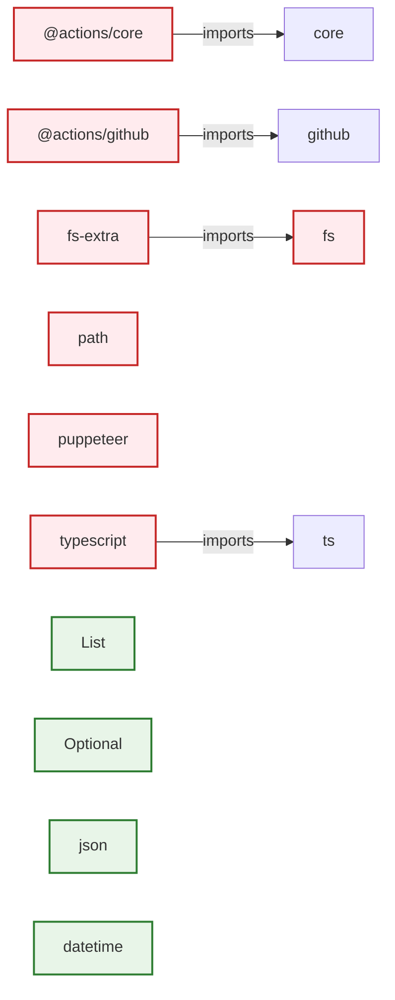

# Dependencies

This interactive diagram contains clickable nodes that link to source code files.

## 📁 Source Code Links

| Component | Type | Language | File Path | Source Link |
|-----------|------|----------|-----------|-------------|
| __init__ | Function | python | tests/sample-project/src/services/UserService.py | [View Source](https://github.com/samjhill/diagrammer/blob/main/tests/sample-project/src/services/UserService.py) |
| ArchitecturalAnalyzer | Component | javascript | src/analyzers/architecturalAnalyzer.js | [View Source](https://github.com/samjhill/diagrammer/blob/main/src/analyzers/architecturalAnalyzer.js) |
| based | Component | javascript | src/generators/diagramGenerator.js | [View Source](https://github.com/samjhill/diagrammer/blob/main/src/generators/diagramGenerator.js) |
| calls | Component | javascript | src/generators/diagramGenerator.js | [View Source](https://github.com/samjhill/diagrammer/blob/main/src/generators/diagramGenerator.js) |
| CodeAnalyzer | Component | javascript | src/analyzers/codeAnalyzer.js | [View Source](https://github.com/samjhill/diagrammer/blob/main/src/analyzers/codeAnalyzer.js) |
| create_user | Function | python | tests/sample-project/src/services/UserService.py | [View Source](https://github.com/samjhill/diagrammer/blob/main/tests/sample-project/src/services/UserService.py) |
| declarations | Component | javascript | src/analyzers/javascriptAnalyzer.js | [View Source](https://github.com/samjhill/diagrammer/blob/main/src/analyzers/javascriptAnalyzer.js) |
| DiagramExporter | Component | javascript | src/exporters/diagramExporter.js | [View Source](https://github.com/samjhill/diagrammer/blob/main/src/exporters/diagramExporter.js) |
| DiagramGenerator | Component | javascript | src/generators/diagramGenerator.js | [View Source](https://github.com/samjhill/diagrammer/blob/main/src/generators/diagramGenerator.js) |
| export_users | Function | python | tests/sample-project/src/services/UserService.py | [View Source](https://github.com/samjhill/diagrammer/blob/main/tests/sample-project/src/services/UserService.py) |
| for | Component | javascript | src/generators/diagramGenerator.js | [View Source](https://github.com/samjhill/diagrammer/blob/main/src/generators/diagramGenerator.js) |
| generateArchitectureReadme | Component | javascript | src/index.js | [View Source](https://github.com/samjhill/diagrammer/blob/main/src/index.js) |
| get_user | Function | python | tests/sample-project/src/services/UserService.py | [View Source](https://github.com/samjhill/diagrammer/blob/main/tests/sample-project/src/services/UserService.py) |
| GitManager | Component | javascript | src/utils/gitManager.js | [View Source](https://github.com/samjhill/diagrammer/blob/main/src/utils/gitManager.js) |
| JavaScriptAnalyzer | Component | javascript | src/analyzers/javascriptAnalyzer.js | [View Source](https://github.com/samjhill/diagrammer/blob/main/src/analyzers/javascriptAnalyzer.js) |
| languages | Component | javascript | src/index.js | [View Source](https://github.com/samjhill/diagrammer/blob/main/src/index.js) |
| list_users | Function | python | tests/sample-project/src/services/UserService.py | [View Source](https://github.com/samjhill/diagrammer/blob/main/tests/sample-project/src/services/UserService.py) |
| loadConfig | Component | javascript | src/index.js | [View Source](https://github.com/samjhill/diagrammer/blob/main/src/index.js) |
| main | Component | javascript | src/index.js | [View Source](https://github.com/samjhill/diagrammer/blob/main/src/index.js) |
| percentage | Component | javascript | src/generators/diagramGenerator.js | [View Source](https://github.com/samjhill/diagrammer/blob/main/src/generators/diagramGenerator.js) |
| PythonAnalyzer | Component | javascript | src/analyzers/pythonAnalyzer.js | [View Source](https://github.com/samjhill/diagrammer/blob/main/src/analyzers/pythonAnalyzer.js) |
| RelationshipAnalyzer | Component | javascript | src/analyzers/relationshipAnalyzer.js | [View Source](https://github.com/samjhill/diagrammer/blob/main/src/analyzers/relationshipAnalyzer.js) |
| rev | Component | javascript | src/generators/diagramGenerator.js | [View Source](https://github.com/samjhill/diagrammer/blob/main/src/generators/diagramGenerator.js) |
| TypeScriptAnalyzer | Component | javascript | src/analyzers/typescriptAnalyzer.js | [View Source](https://github.com/samjhill/diagrammer/blob/main/src/analyzers/typescriptAnalyzer.js) |
| UserService | Class | python | tests/sample-project/src/services/UserService.py | [View Source](https://github.com/samjhill/diagrammer/blob/main/tests/sample-project/src/services/UserService.py) |
| validate_email | Function | python | tests/sample-project/src/services/UserService.py | [View Source](https://github.com/samjhill/diagrammer/blob/main/tests/sample-project/src/services/UserService.py) |
| visit | Component | javascript | src/analyzers/typescriptAnalyzer.js | [View Source](https://github.com/samjhill/diagrammer/blob/main/src/analyzers/typescriptAnalyzer.js) |

---
*Generated by [Diagrammer GitHub Action](https://github.com/samjhill/diagrammer)*
*Click on diagram nodes to view source code*