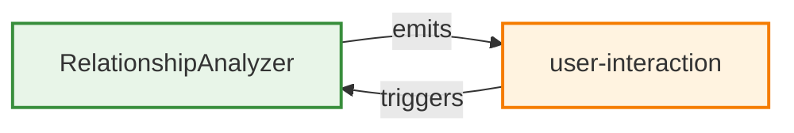

# Event Flow

This interactive diagram contains clickable nodes that link to source code files.

## 📁 Source Code Links

| Component | Type | Language | File Path | Source Link |
|-----------|------|----------|-----------|-------------|
| ArchitecturalAnalyzer | Component | javascript | N/A | N/A |
| based | Component | javascript | N/A | N/A |
| calls | Component | javascript | N/A | N/A |
| CodeAnalyzer | Component | javascript | N/A | N/A |
| declarations | Component | javascript | N/A | N/A |
| DiagramGenerator | Component | javascript | N/A | N/A |
| for | Component | javascript | N/A | N/A |
| GitManager | Component | javascript | N/A | N/A |
| JavaScriptAnalyzer | Component | javascript | N/A | N/A |
| languages | Component | javascript | N/A | N/A |
| loadConfig | Component | javascript | N/A | N/A |
| main | Component | javascript | N/A | N/A |
| percentage | Component | javascript | N/A | N/A |
| PythonAnalyzer | Component | javascript | N/A | N/A |
| RelationshipAnalyzer | Component | javascript | N/A | N/A |
| rev | Component | javascript | N/A | N/A |
| TypeScriptAnalyzer | Component | javascript | N/A | N/A |
| visit | Component | javascript | N/A | N/A |

---
*Generated by [Diagrammer GitHub Action](https://github.com/samjhill/diagrammer)*
*Click on diagram nodes to view source code*