```mermaid
graph TB
  classDef component fill:#e3f2fd,stroke:#1976d2,stroke-width:2px
  classDef external fill:#ffebee,stroke:#c62828,stroke-width:2px
  classDef internal fill:#e8f5e8,stroke:#2e7d32,stroke-width:2px
  main["main"]
  main:::component
  languages["languages"]
  languages:::component
  loadConfig["loadConfig"]
  loadConfig:::component
  ArchitecturalAnalyzer["ArchitecturalAnal..."]
  ArchitecturalAnalyzer:::component
  based["based"]
  based:::component
  calls["calls"]
  calls:::component
  CodeAnalyzer["CodeAnalyzer"]
  CodeAnalyzer:::component
  declarations["declarations"]
  declarations:::component
  DiagramExporter["DiagramExporter"]
  DiagramExporter:::component
  DiagramGenerator["DiagramGenerator"]
  DiagramGenerator:::component
  for["for"]
  for:::component
  JavaScriptAnalyzer["JavaScriptAnalyzer"]
  JavaScriptAnalyzer:::component
  percentage["percentage"]
  percentage:::component
  PythonAnalyzer["PythonAnalyzer"]
  PythonAnalyzer:::component
  RelationshipAnalyzer["RelationshipAnalyzer"]
  RelationshipAnalyzer:::component

```

# Layer Focus: unknown

This diagram was automatically generated from your codebase.

## 📊 Architecture Overview

- **Components**: 15 analyzed
- **Languages**: javascript
- **Architectural Patterns**: None detected
- **External Dependencies**: 0 packages
- **Generated**: 10/22/2025

## 🧠 Architectural Insights

- 🔍 **High Analysis Complexity**: Multiple analyzers detected - consider consolidating analysis logic
- ⚡ **Complex Components**: 1 components with high complexity - consider refactoring

## 🎨 Legend

| Component Type | Color | Description |
|---|---|---|
| 🔍 **Analyzer** | Green | Code analysis components |
| 🎨 **Generator** | Orange | Diagram generation components |
| ⚙️ **Manager** | Purple | Resource management components |
| 🔧 **Service** | Teal | Business logic and services |
| 📦 **NPM** | Blue | Node.js packages |
| 🏗️ **Framework** | Light Green | Framework dependencies |
| 🌐 **External** | Red | External libraries |

## 📊 Visual Indicators

| Symbol | Meaning | Description |
|---|---|---|
| 📦 | Large Component | Component with >100 lines of code |
| 📄 | Medium Component | Component with 50-100 lines of code |
| 📝 | Small Component | Component with <50 lines of code |
| ⚡ | High Complexity | Complex component (complexity ≥4) |
| 🔥 | Medium Complexity | Moderate complexity (complexity ≥3) |
| 🔗 | High Dependencies | Component with >5 dependencies |

## 🔗 Relationship Types

- **imports**: Module imports and dependencies
- **calls**: Method/function calls
- **generates**: Component generates output
- **uses**: Component utilizes another component
- **API**: API calls and communication
- **data**: Data flow between components

## Summary Tables

### Component Summary

| Component | Type | Language | Path | Dependencies |
|-----------|------|----------|------|-------------|
| main | Component | javascript | N/A | 0 |
| languages | Component | javascript | N/A | 0 |
| loadConfig | Component | javascript | N/A | 0 |
| ArchitecturalAnalyzer | Component | javascript | N/A | 0 |
| based | Component | javascript | N/A | 0 |
| calls | Component | javascript | N/A | 0 |
| CodeAnalyzer | Component | javascript | N/A | 0 |
| declarations | Component | javascript | N/A | 0 |
| DiagramExporter | Component | javascript | N/A | 0 |
| DiagramGenerator | Component | javascript | N/A | 0 |
| for | Component | javascript | N/A | 0 |
| JavaScriptAnalyzer | Component | javascript | N/A | 0 |
| percentage | Component | javascript | N/A | 0 |
| PythonAnalyzer | Component | javascript | N/A | 0 |
| RelationshipAnalyzer | Component | javascript | N/A | 0 |

### Language Distribution

| Language | Components | Percentage |
|----------|------------|------------|
| javascript | 15 | 100.0% |

---
*Generated by [Diagrammer GitHub Action](https://github.com/samjhill/diagrammer)*
