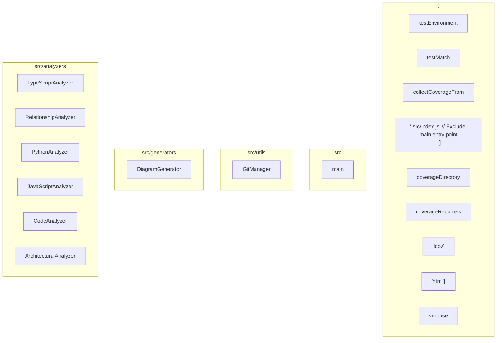

# Module Structure

This diagram was automatically generated from your codebase.

```mermaid
graph TB
  classDef module fill:#e3f2fd,stroke:#1976d2,stroke-width:2px
  classDef export fill:#e8f5e8,stroke:#388e3c,stroke-width:2px
  classDef group fill:#f3e5f5,stroke:#7b1fa2,stroke-width:3px

  subgraph _["."]
    testEnvironment["testEnvironment"]
    testMatch["testMatch"]
    collectCoverageFrom["collectCoverageFrom"]
    __src_index_js_____Exclude_main_entry_point____["'!src/index.js' // Exclude main entry point
  ]"]
    coverageDirectory["coverageDirectory"]
    coverageReporters["coverageReporters"]
    _lcov_["'lcov'"]
    _html__["'html']"]
    verbose["verbose"]
  end

  subgraph src["src"]
    main["main"]
  end

  subgraph src_utils["src/utils"]
    GitManager["GitManager"]
  end

  subgraph src_generators["src/generators"]
    DiagramGenerator["DiagramGenerator"]
  end

  subgraph src_analyzers["src/analyzers"]
    TypeScriptAnalyzer["TypeScriptAnalyzer"]
    RelationshipAnalyzer["RelationshipAnalyzer"]
    PythonAnalyzer["PythonAnalyzer"]
    JavaScriptAnalyzer["JavaScriptAnalyzer"]
    CodeAnalyzer["CodeAnalyzer"]
    ArchitecturalAnalyzer["ArchitecturalAnalyzer"]
  end


```

---
*Generated by [Diagrammer GitHub Action](https://github.com/samjhill/diagrammer)*
